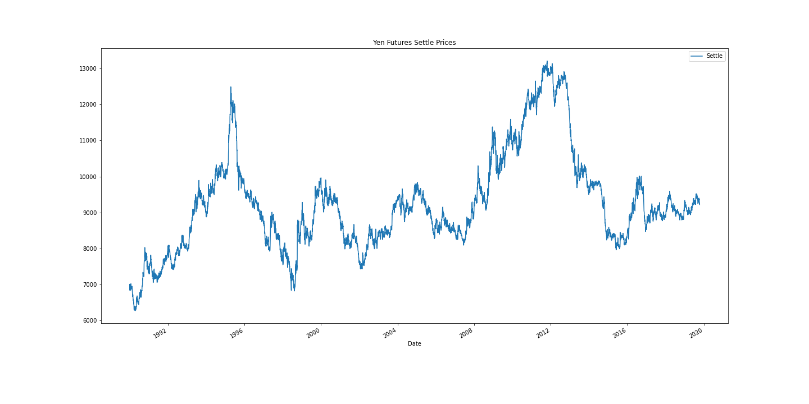
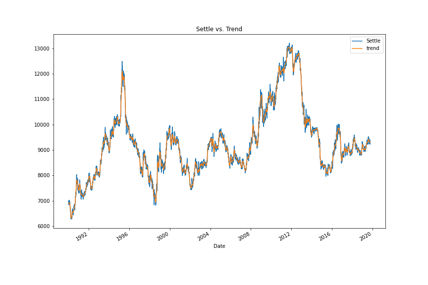
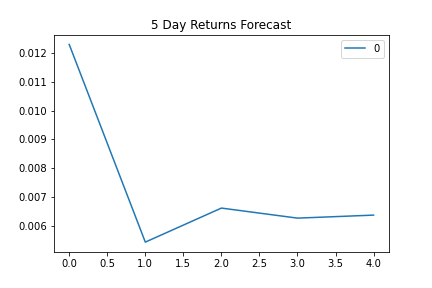
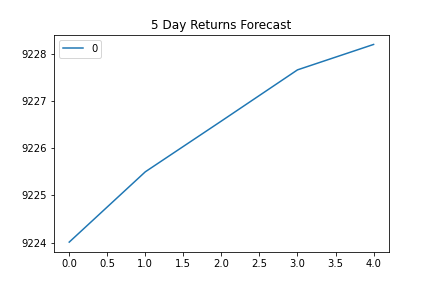
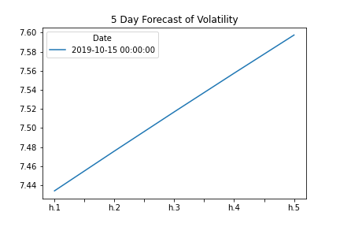
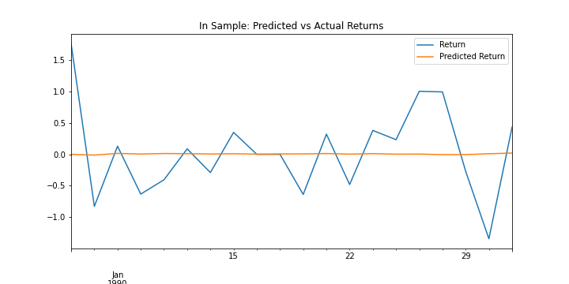

# Unit 10—A Yen for the Future

Time Series - Homework 10

## Initial Time-Series Plotting

There seems to be an upward trend during the 1990-2020 period, increasing from ~7,000 to ~9250; however, there were multiple cycles in the middle

To further analyze the behaviour of the Yen in the 1990-2020 period, we use a Hodrick-Prescot Filter to help us decompose volatility (or noise) from trends.

As evidenced in the below chart, this model does a good job in identifying the trends. 

We then utilized two different models to predict future values of the Yen, the ARMA, ARIMA and GARCH models. 

The ARMA model was used to predict the daily returns of the Yen and the ARIMA to predict the future value of the Yen, teh GARCH.

### ARMA model:
##### Description: 
The ARMA model combines an Autoregressive model and a Moving Average model. The Autoregresive model explains a the value of a given variable today by a combination of its past values. The moving average model explains the current value of a given variable today by the variable's  'error'. The Arma model combines both. 

##### Findings: 
The ARMA model we used has 2 AR lags and 1 MA lag. The only lag that is statistically significantly is the second AR lag with a p-values of 0.04. All the coefficients' p-values are grater than 2. 

##### Predictions: 
As the charts indicates the yen is expected to grow in the following 5 days after the last day of the sample. 

### ARIMA model:
##### Description: 
The ARIMA model uses the same foundations of the ARMA model with one significant change, it uses the change in the variable (or returns in the case of the daily change in the yen). This model is used when the underlying characteristics of the variable changes over time. By using the daily change, you pass the settle price as an input and the model calculates the change in price. 

##### Findings: 
The ARIMA model has 5 AR lags and 1 MA lag. None of the lags are statistically significant, observed in their P-values higher than 0.05. 
    
##### Predictions: 
As the charts indicates the yen is expected to grow in the following 5 days after the last day of the sample, from 9224 to 9228. The % change however, is relatively small and in line with teh ARMA model. 

  

### GARCH model:
##### Description: 
The GARCH model uses the same foundations of the ARMA model; however, it is used to predict volatility. 

##### Findings: 
The ARIMA model has 5 AR lags and 1 MA lag. None of the lags are statistically significant, observed in their P-values higher than 0.05. 
    
##### Predictions: 
As the charts indicates the yen's volatility is expected to grow slightly in the following 5 days after the last day of the sample. 

  

### Conclusions:
* Based solely on the analysis, while it seems the price will increase, the predicatbility of the models seems relatively weak at best. Also, the expected price increase seems very low in the next week in hand with increased volatility. An additional analysis is needded to estimate if the additional risk we are taking is justified by the returns. 

* On the other hand, when looking at the longer term trend and cycle, the YEN seems to be well positioned for the next up cycle. 

## Regression Analysis

In this section we used a linear regresion model to predict future returns. 

In line iwth the prior models, we observed that the best prediction was a return close to 0.

  

### Conclusions:

* The linear regression analysis to predict future returns of the yen has a low predictive value when looking at the out of sample RMSE, which is a measure of how close the predicted values are to the actual values

* The estimated returns are close to 0, and while it may directionally follow the actual returns, the magnitude of the changes is small (close to 0) (first chart above)

* For the above reasons, one can conclude that a) the best prediction of the change of the Yen is 0 or that the linear regression model fails to predict future returns in the Yen 

Additional Observations:

* The predictive power of the in sample model, is significantly larger than that for the out of sample when measured by the RMSE. The in sample RMSE is 0.706 vs an out of sample RMSE of 0.414.

* While one may think that the linear regression did a better job in the in sample prediction, the estimated return is still close to 0 and not different than the out of sample estimated return, also 0. One may argue that the reason for a better prediction is either overfitting or in this specific case, lower volatility in the training sample.
